# OpenNNA:一个可根据FPGA资源自由裁剪的通用神经网络FPGA加速器
## 作者:xddcore(Chengsen Dong)|大三毕业设计
## Email:1034029664@qq.com
## Github:www.github.com/xddcore
## Version:1.2
## Date:23/10/2021
## 本研究成果已发表于UKSim2022会议(论文见./paper文件夹)。

# 项目简介
**OpenNNA**(*Opensource Neural Network Accelerator*)计划使用Xilinx ZYNQ 7020平台实现通用神经网络加速器。实现对神经网络的计算加速。

# 项目特性
1. 支持**Conv2d卷积**，支持**Depthwish Conv2d卷积**，支持**MobileNETV2 Bottleneck结构**, 卷积核为**1x1或 3x3**,stride为**1或2**。
2. Same对称paddings (TensorFlow 在 stride=2同时尺寸为偶数时使用非对称 paddings)。
3. 特征图尺寸：特征图小于等于 320x320(WxH)，通道数在 1到 1024。
4. MaxPool(**2x2或4x4)** 和AveragePool(**2x2或 x4**)。
5. 任意逐元素激活函数(**ReLU, ReLU6, LeakyRelu, Sigmoid**)。
6. **xddcore说:以上的尺寸约束都可打破**。
7. 强大的**流水线控制器**和**标准的控制接口**，RAM和PE高度复用，尽可能的提升推理速度(面积铺开，咱就是全场最靓的崽）。
8. **可任意快速修改的网络结构**，在RAM足够的情况下，支持**无穷多层网络**。
9. 相比于传统GPU，**超低的功耗**。
10. **大三学生写的代码，拒绝繁琐语法，代码简单，可读性极佳**。
11. 以**Tensorflow**为核心的一系列python小脚本，折腾性极佳。
12. 多应用场景:**目标分类(√)|目标检测(√)|语音识别(√)|etc...|**，xddcore说:下到手写数字识别，上到自动驾驶，左到RoboMaster装甲板识别，又到人脸识别通通一站式搞定。**年轻人的手中握着通往未来的钥匙！**
13. xddcore说:准备上ZYNQ-7100了(**欢迎推荐合适的海外供货商**），后续描述RNN？还有更多特性，正在开发中...

# 项目开发规划

1. 本项目于**10月1日**开始全速开发，预计于**11月30日**完成OpenNNA Ver1.0开发(耗时**60天**)。
2. 技术文档将会以**每周一次**的频率进行版本更新，并根据开发进度中产生的新的想法，不断完善早期版本文档中的错误表述或不清晰的表述。力争在项目完成后，技术文档将成为本项目的开发白皮书。(**每周五**将会根据上周工作，发布一个新版本的技术文档)
3. 项目CheckPoint分为两个类型:在**Main CheckPoint List**中提到的技术点保持以最高优先级实现;在**Extra CheckPoint List**中提到的技术点在保证不耽误项目进度的情况下，可以进行实现。

## Main CheckPoint List
- [x] 1.利用Tensorflow搭建MobileNET V1卷积神经网络
- [x] 2.深度分析MobileNET V1卷积神经网络结构，撰写MobileNET网络结构分析章节
- [x] 3.加载预训练权重/根据数据集训练一个权重，得出标准权重(此权重用于后续比较神经网络是否手写搭建成功)。并评估UINT8精度TFlite模型性能。
- [x] 4.利用Python手写实现MobileNET V1卷积神经网络，加载标准权重。并与使用TensorFlow搭建的神经网络运算结果进行比较，保证手写结果无误。
- [x] 5.设计PE单元结构与加速器整体结构。
- [x] 6.利用C++语言手写PE（Processing Element）,并使用Xilinx Vivado HLS高层次综合工具生成HLS IP核。
- [x] 7.在HLS层面仿真并测试IP核结果，与Tensorlow运算结果进行比较，保证HLS中综合无误。
- [x] 8.利用HLS优化经验，将单个PE的资源占用率，处理速度优化至最高。
- [x] 9.完成对于LeNET的专用数字识别加速器，并测试性能，录制DEMO视频。
- [ ] 10.利用之前对LeNET加速的经验，编写并测试通用卷积加速器，通用池化加速器，通用激活函数加速器，通用全连接加速器。
- [ ] 11.使用通用卷积加速器，通用池化加速器，通用激活函数加速器等再次实现对LeNET的加速。
- [ ] 12.使用通用卷积加速器，通用池化加速器，通用激活函数加速器等实现基于YOLO V2思想的目标检测Demo。
- [ ] 13.完成通用单周期神经网络加速器。
- [ ] 14.测试单周期卷积神经网络加速器性能与稳定性，制作性能报表。
- [ ] 15.研究如何加入流水线控制器，控制多个加速器流水处理。**(流水处理的意义在于，能够在实时情况下(摄像头视频流)，提高卷积神经网络加速器处理性能)**
- [ ] 16.完成流水线卷积神经网络处理器。
- [ ] 17.测试流水线卷积神经网络加速器性能与稳定性，制作性能报表。
- [ ] 18.分别测试JetsonNANO在CPU和CUDA的性能表现，并与单周期卷积神经网络加速器和流水线卷积神经网络加速器比较。
- [ ] 19.测试i5-1135G7 @ 2.40GHz × 8的性能表现，并与单周期卷积神经网络加速器和流水线卷积神经网络加速器比较。
- [ ] 20.测试树莓派4b(8GB)的性能表现，并与单周期卷积神经网络加速器和流水线卷积神经网络加速器比较。
- [ ] 21.提出一个最能体现加速器性能的应用DEMO，完成并录制DEMO视频。
- [ ] 22.整理研究过程，撰写论文，完成毕业设计。


## Extra CheckPoint List
- [ ] 1.通用卷积神经网络增加对MobileNET V2的支持
- [ ] 2.制作更多应用DEMO

## 应用DEMO
- [ ] 1.1000类实时分类器(**ImageNET Dateset**)
- [ ] 2.英国车牌识别(输入车牌图片，输出车牌信息；应用范围:任何有闸机的场景，例如停车场)

--- 

# 项目技术细节

## 1.MobileNET网络结构分析
详细MobileNET网络结构见OpenNNA-Mobilenet网络结构.xlsx文件。
### 网络层解析

#### 卷积层(Convolution 2D Layer)
##### 卷积层概述
>> 大牛说:卷积运算是卷积神经最关键的计算方法

一句话概述卷积运算:一个对输入矩阵和卷积核矩阵求内积的运算。  
矩阵内积运算:两个矩阵对应位置元素相乘后后的所有结果相加。
一些计算例子:

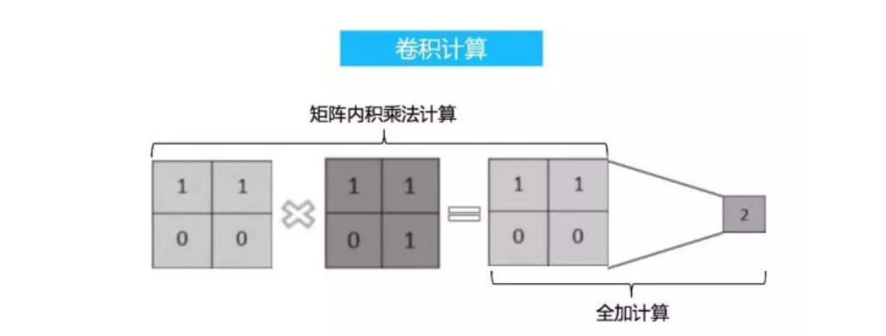
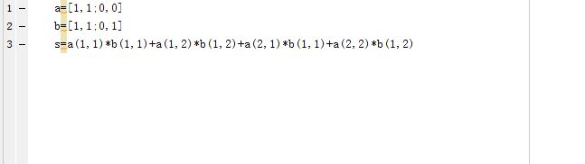
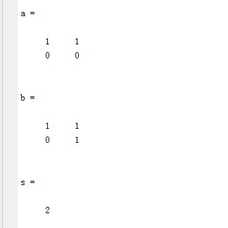

##### 卷积层计算

对于卷积层来说，输入矩阵通常为图像矩阵(灰度图像为单通道矩阵，RGB图像为三通道矩阵)。通常情况下，输入图像矩阵的大小远大于卷积核矩阵大小(卷积核矩阵大小一般为3*3,且通常为奇数[当为奇数时，卷积核会有一个中心对称像素，在图像处理中有一个特殊点是非常好的])。所以要对一个输入图像矩阵进行卷积运算时，需要运用滑动窗口的方式进行计算。
引入滑动窗口方式进行对输入矩阵的卷积运算后，会再引入一个变量——步长(Stride)。Stride为进行完一次卷积运算后，滑动窗口的移动距离，单位为1个像素(Pix)。
具体的滑动过程如下图所示:

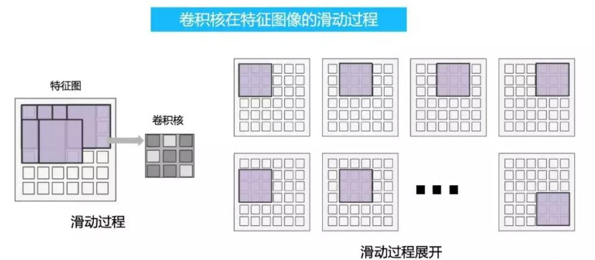

不同Stride下滑动过程如下图所示:
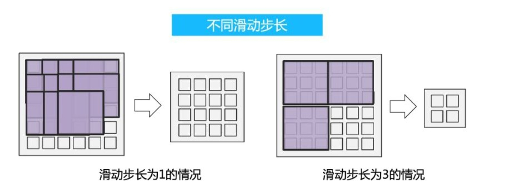

##### 卷积层另一个特性填充(Padding)
随着我们对上述卷积过程的理解，我们发现卷积运算是一个降采样运算。为什么这么说呢？假设一个输入图像矩阵大小为8* 8，经过一个3* 3卷积核的卷积运算后(Stride=1),输出结果矩阵大小为6* 6(8-3+1)。结果矩阵大小比图像矩阵小，假设进行n次卷积后，图像矩阵将会越来越小。这并不是我们所希望的；
同时，我们发现位于图像四周(边缘)的像素参与卷积卷积运算的次数非常少，而其他地方的像素多次参与卷积计算。这样导致丢失了边界上许多信息。
为了解决如上两个问题，我们引入了卷积层的另外一个特性填充(Padding)。
填充，顾名思义就是在输入矩阵外围添加一圈新的矩阵元素（添加的矩阵元素可为任意值，一般为1或0）。
填充的过程如下:

填充只有一个目标，保留图像边缘像素信息，所以在tensorflow等框架上可以便捷的设置填充目标{vaild（无填充）/same(填充至输出图像与输入图像大小相同）}。
对于上面我们举的例子来说:
输入图像矩阵大小为8* 8，经过一个3* 3卷积核的卷积运算后(Stride=1),输出结果矩阵大小为6* 6(8-3+1)。
假如我们想让输出结果矩阵大小也为8* 8的话，我们需要在行和列上分别补充两个像素点(8-6=2，Padding=1，对称补充)。

##### 卷积层作用
提炼图像特征信息

---

#### 深度可分离卷积层(Depthwish Convolution Layer)

##### 深度可分离卷积概述与计算方法

深度可分离卷积由**逐通道卷积**(Channelwise Convolution)和**逐点卷积**(Pointwise Convolution)构成，Depthwise Convolution的一个卷积核负责一个通道，一个通道只被一个卷积核卷积，然后生成一个特征图(Feature Map)。在卷积核为3 * 3大小下使用深度可分离卷积能够使网络参数量下降为原来的1/8至1/9。

**为什么参数量会减少？**
对于常规卷积来说，特征的提取和融合是放在一起的。每个卷积核都需要对图像的所有通道(如果是RGB的话，就是三个通道，卷积核也需要有三个通道)进行矩阵内积计算。
而对于深度可分离卷积来说，特征的提取和融合是分开的(即逐通道卷积实现特征提取，逐点卷积实现特征融合)。在特征提取过程(也就是逐通道卷积过程)中,一个卷积核只负责提取一个通道的信息，卷积核只有一个通道。在特征融合过程中，常规卷积需要输出n个特征图则需要引入n个3 * 3 *3 的卷积核；而对于逐点卷积融合来说，需要输出n个特征图需要引入n个1 * 1 *3的卷积核。无论从参数量还是计算量来说，深度可分离卷积都优于常规卷积。

对于逐通道卷积来说，一张5×5像素、三通道彩色输入图片（shape为5×5×3），Depthwise Convolution首先经过第一次卷积运算，DW完全是在二维平面内进行。卷积核的数量与上一层的通道数相同（通道和卷积核一一对应）。所以一个三通道的图像经过运算后生成了3个Feature map(如果有same padding则尺寸与输入层相同为5×5)，如下图所示。


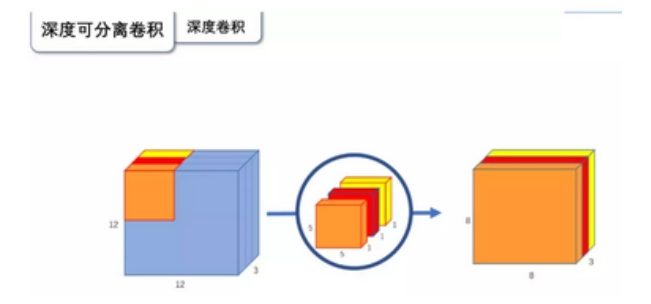

其中一个Filter只包含一个大小为3×3的Kernel，卷积部分的参数个数计算如下：
N_depthwise = 3 × 3 × 3 = 27


Depthwise Convolution完成后的Feature map数量与输入层的通道数相同，无法扩展Feature map。而且这种运算对输入层的每个通道独立进行卷积运算，没有有效的利用不同通道在相同空间位置上的feature信息。因此需要**逐点卷积**(Pointwise Convolution,也就是1 * 1 * Chanel的卷积核)来将这些Feature map进行组合生成新的Feature map。

---

#### 批标准化层(Batch Normalization Layer)

##### 批标准化层概述
在神经网络训练中，训练集的数据分布会影响训练的结果。如果训练集的数值太大或太小会让激活函数处于饱和阶段，无法正确理解训练数据的特征。比如**某个神经元X的值为1**, **某个Weights的初始值为0.1**, 这样后一层神经元计算结果就是**Wx = 1 * 0.1 = 0.1**; 又或者当**x=20**, 这样**Wx的结果就为2**。当我们加上一层激励函数, 激活这个Wx值的时候, 问题就来了. 如果使用 像tanh的激励函数,Wx的激活值就变成了 0.1 和 1, 接近于 1 的部已经处在了 激励函数的饱和阶段, 也就是如果X无论再怎么扩大, tanh 激励函数输出值也还是 接近1. 换句话说, 神经网络在初始阶段已经不对那些比较大的X特征范围敏感了. 这样很糟糕, 想象我轻轻拍自己的感觉和重重打自己的感觉居然没什么差别, 这就证明我的感官系统失效了. 当然我们是可以用之前提到的对数据做**Normalization**预处理, 使得输入的X变化范围不会太大, 让输入值经过激励函数的敏感部分. 但刚刚这个不敏感问题不仅仅发生在神经网络的输入层, 而且在隐藏层中也经常会发生.

##### 批标准化算法过程

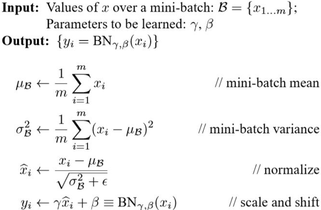

---

#### 激活函数

##### ReLu激活函数概述

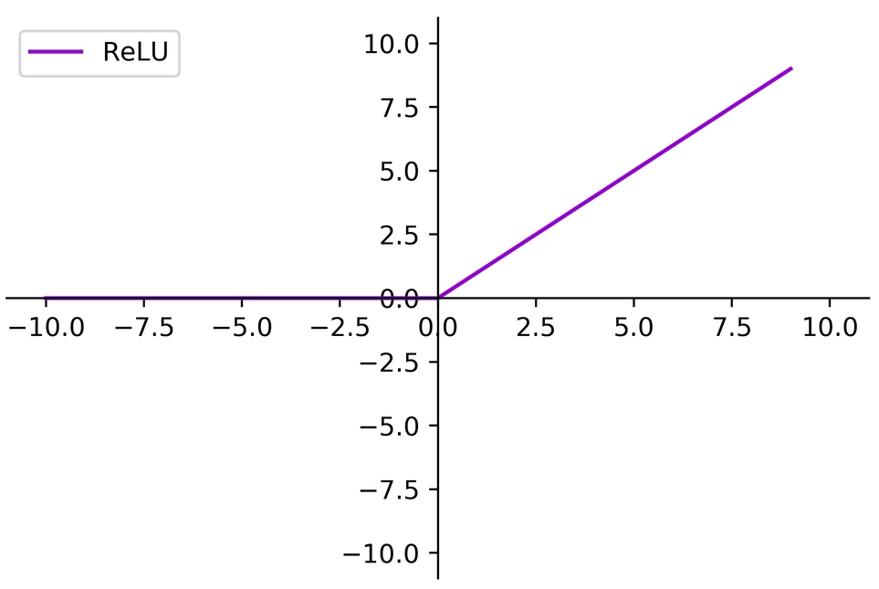
函数公式 f(x) = max(0,x)

##### SoftMax归一化指数函数
概率有两个性质：1）预测的概率为非负数；2）各种预测结果概率之和等于1。
softmax就是将在负无穷到正无穷上的预测结果按照这两步转换为概率的。

1）将预测结果转化为非负数
下图为y=exp（x）的图像，我们可以知道指数函数的值域取值范围是零到正无穷。softmax第一步就是将模型的预测结果转化到指数函数上，这样保证了概率的非负性。
.jpg)


2）各种预测结果概率之和等于1
为了确保各个预测结果的概率之和等于1。我们只需要将转换后的结果进行归一化处理。方法就是将转化后的结果除以所有转化后结果之和，可以理解为转化后结果占总数的百分比。这样就得到近似的概率。

下面为大家举一个例子，假如模型对一个三分类问题的预测结果为-3、1.5、2.7。我们要用softmax将模型结果转为概率。步骤如下：

1）将预测结果转化为非负数

y1 = exp(x1) = exp(-3) = 0.05
y2 = exp(x2) = exp(1.5) = 4.48
y3 = exp(x3) = exp(2.7) = 14.88

2）各种预测结果概率之和等于1

z1 = y1/(y1+y2+y3) = 0.05/(0.05+4.48+14.88) = 0.0026
z2 = y2/(y1+y2+y3) = 4.48/(0.05+4.48+14.88) = 0.2308
z3 = y3/(y1+y2+y3) = 14.88/(0.05+4.48+14.88) = 0.7666

总结一下softmax如何将多分类输出转换为概率，可以分为两步：
1）通过指数函数，将实数输出映射到零到正无穷。
2）将所有结果相加，进行归一化。

---

#### 全局平均池化（Global Average Pooling 2D）

##### 全局平均池化概述
Global Average Pooling 2D就是依次将将输入矩阵的每个通道的矩阵元素相加再求平均，每个通道输出一个平均值。
```Python
import tensorflow as tf

x = tf.random.normal((1,2,2,3))
x.shape
#  TensorShape([1, 2, 2, 3])
x
#
<tf.Tensor: shape=(1, 2, 2, 3), dtype=float32, numpy=
array([[[[ 1.0732665 , -0.316923  ,  0.34387082],
         [ 0.85719526,  0.383818  ,  0.0714375 ]],

        [[ 2.07628   ,  1.0945694 ,  0.6519038 ],
         [ 0.00441903,  1.2396817 ,  0.10125866]]]], dtype=float32)>


ax = tf.keras.layers.GlobalAveragePooling2D()(x)
ax.shape
# TensorShape([1, 3])
ax
#
<tf.Tensor: shape=(1, 3), dtype=float32, numpy=array([[1.0027902 , 0.60028654, 0.29211769]], dtype=float32)>
```

---

## 2.MobiletNet预训练权重

>标定权重下载链接:https://github.com/fchollet/deep-learning-models/releases
Tflite量化参考链接:https://www.tensorflow.org/lite/performance/post_training_quantization
Tensorflow INT8量化规范：https://www.tensorflow.org/lite/performance/quantization_spec
(Netron开源链接:https://github.com/lutzroeder/netron)
量化后模型性能评估工具:https://github.com/tensorflow/tensorflow/tree/master/tensorflow/lite/tools/evaluation/tasks
面向ImageNet数据集的评估工具:https://github.com/tensorflow/tensorflow/tree/master/tensorflow/lite/tools/evaluation/tasks/imagenet_image_classification#image-classification-evaluation-based-on-ilsvrc-2012-task
ImageNet数据集:https://image-net.org/challenges/LSVRC/2012/2012-downloads.php
ImageNet2012数据集说明:https://www.tensorflow.org/datasets/catalog/imagenet2012
基准MobileNETV1 TFLite模型:https://www.tensorflow.org/lite/guide/hosted_models
bazel安装说明:https://docs.bazel.build/versions/main/install-ubuntu.html

本次标定测试权重采用基于ImageNET数据训练的1000分类权重（**MobileNet 224*224 α=1.0 top**）进行测试，由于本项目主要研究重点为**FPGA内部卷积神经网络加速器结构设计**，针对于网络模型的优化，剪枝并不是重点。为了极大程度上的展现所设计项目的性能，我们优先基于ImageNET数据集实现1000分类网络(大部分的论文以在ImageNET数据集上的性能来展示其论文的卓越)。

**关于本次所使用ILSVRC 2012数据集的信息如下:**
>There are a total of 50,000 validation images. They are named as
      ILSVRC2012_val_00000001.JPEG
      ILSVRC2012_val_00000002.JPEG
      ...
      ILSVRC2012_val_00049999.JPEG
      ILSVRC2012_val_00050000.JPEG
There are 50 validation images for each synset.
The ground truth of the validation images is in 
    data/ILSVRC2012_validation_ground_truth.txt,
where each line contains one ILSVRC2012_ID for one image, in the ascending alphabetical 
order of the image file names.

使用tensorflow tflite转换工具将权重精度为float32模型强制转换为UINT8精度(量化)的TFlite模型。为了保证量化的精度，我们应该在量化过程中提供含有400-500张数据集图片的量化参考集。

### **为什么需要将网络权重从Float32转换为uint8**
对于嵌入式系统和本项目中的FPGA来说，他们有如下特性：1.计算性能较弱 2.有限的RAM空间。如果神经网络权重精度为Float32，则会消耗较大的计算性能，降低网络推理速度。同时大量的Float32精度权重对于内存是及不友好的(Float32精度权重将比INT8权重更占用内存空间)。对于推理速度来说，虽然使用INT8权重进行推理，可能会降低神经网络的准确率，但是能够获得较高的推理速度。

为了方便观察神经网络结构和神经网络权重，使用开源工具Netron进行对网络参数的可视化查看。在经过量化后，我们们使用Netron开源工具进行对量化结果的查看如下图,可以看到我们模型的权重已被量化为INT8，模型体积下降为原来的1/4。

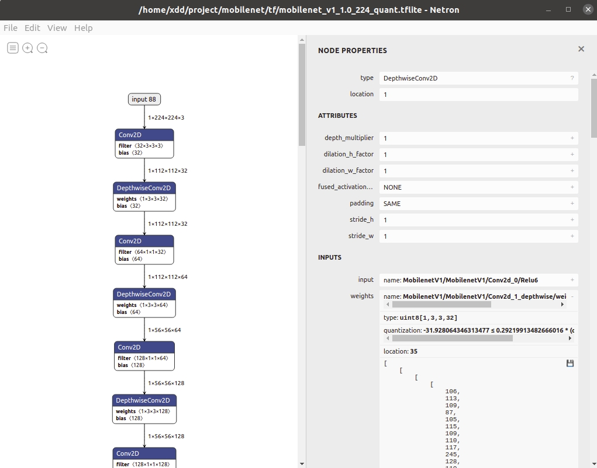
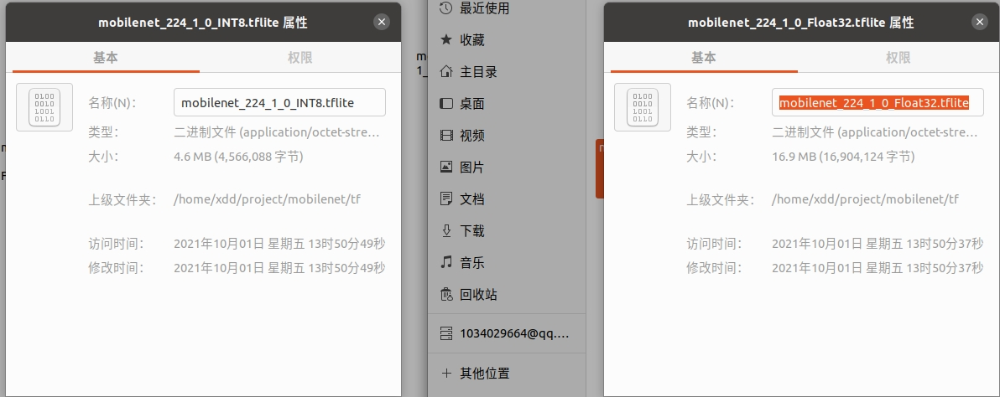

在观察量化过程时，我们发现**Batch Normilation批标准化操作和Bias（偏置）是等价的**,在进行对TFLite文件量化到UINT8精度的过程中，会将Batch Normilation转换成加法偏置操作。

**评估tflite模型性能操作需要Bazel 3.7.2**
```
cd "/home/xdd/.bazel/bin" && curl -fLO https://releases.bazel.build/3.7.2/release/bazel-3.7.2-linux-x86_64 && chmod +x bazel-3.7.2-linux-x86_64
```

### 量化后的UINT8 TFLite 性能评估
我们采用ILSVRC2012验证集(1000类,50，000张图片)对量化后的TFLite模型进行性能评估，性能评估的结果如下:
**MobileNET V1 UINT8 i5-1135G7 @ 2.40GHz × 1**

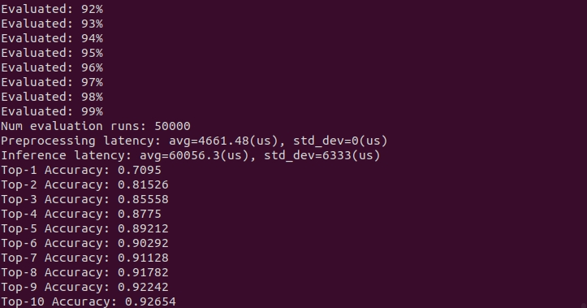

**MobileNET V2 Float32 i5-1135G7 @ 2.40GHz × 1**

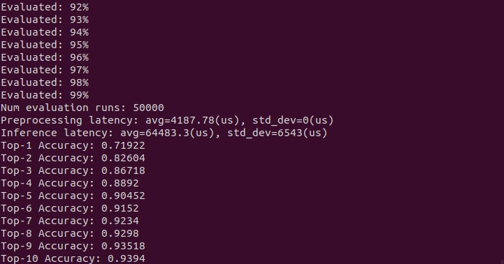

**MobileNET V2 UINT8 i5-1135G7 @ 2.40GHz × 1**

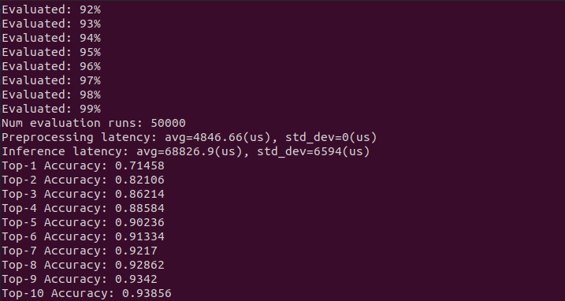

---

## 3.使用HLS Tools设计PE单元

>PYNQ DMA Libary:https://pynq.readthedocs.io/en/v2.6.1/pynq_libraries/dma.html#pynq-libraries-dma
AXI DMA:https://www.xilinx.com/support/documentation/ip_documentation/axi_dma/v7_1/pg021_axi_dma.pdf

### PE单元结构设计

#### PE单元结构图
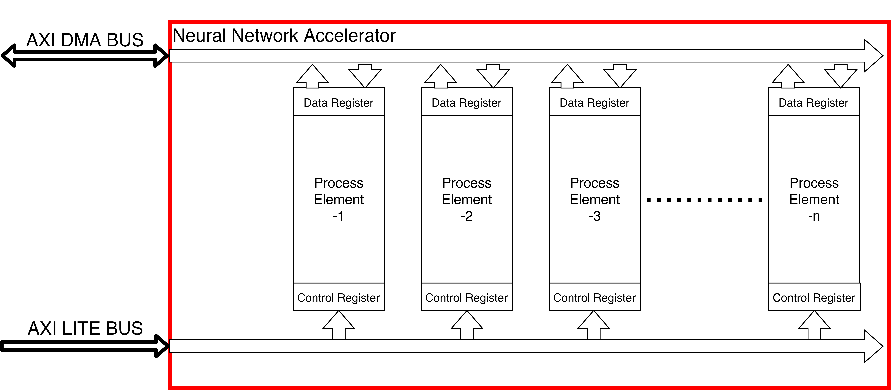
以上为本设备PE单元结构图，在位于ZYNQ PL端的Neural Network Accelerator中将会实现以上结构。其中Process Element为处理核心。根据最后FPGA资源的情况，将会分布多个PE。PE的一些基本参数(开启/关闭)通过AXI Lite总线被Dual Core Arm-A9控制。同时PE运行后的结果通过AXI DMA BUS或AXI Stream高速传递至Dual Core Arm-A9。
#### 权重及中间变量存储
受限于ZYNQ 7020 内部BRAM大小(0.6125MB)远小于MobileNET网络参数量(4.3MB)。所以我们放弃了将权重完全存储到BRAM中的想法。由于PL端外挂1GB DDR3内存，所以我们采用ZYNQ 7020内部高性能AXI总线 DMA(直接内存访问)方案，力争将权重访问与计算结果存储造成的时间延迟设计至最低水平。
**(以上方案被放弃)**
众所周知，ZYNQ FPGA端BRAM只有0.625MB大小，如果按照以上方案，不把网络放在BRAM中，而是放在1GB DDR3内存中，经过最近的研究将会引起如下问题:
1. 神经网络运行速度缓慢，MobileNET有26层卷积结构，经过Vivado HLS的评估报告，一层Conv将耗时100ms左右，这样整个网络跑一遍将会需要3秒左右，速度太过缓慢。且由于ZYNQ 7020 FPGA资源稀少。依赖堆硬件实现并行的想法在这里是行不通的。
2. 通过AXI DMA总线读写DDR的程序过于复杂，工作难度非常庞大。

由于以上问题，我思考了第二个解决办法:如果想把MobileNet放入FPGA中。MobileNET的网络深度因子必须等于0.25(当网络深度因子等于0.25时，网络权重大小差不多为0.5MB左右)。但是这个办法也失败了。经过Vivado HLS的评估，此时一层模型的效率为:

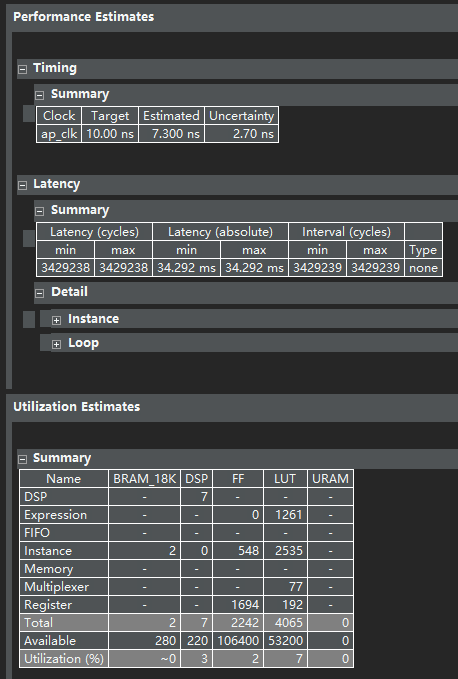
一层Conv运行竟然需要35ms，且已经占用了非常庞大的FPGA硬件资源。由于MobileNET有26层，如果将上述资源占用*26，即便考虑硬件复用，也是行不通的。

在调试的过程中，我还发现Vivado HLS的 C++ Debugger并不高效。于是我转向了使用Visual Studio来调试我的C++代码。在调试过程中，我越来越觉得，之前选择的网络实在是太大了。无论从FPGA资源占用来说，还是从调试代码角度上来说，都已经非常困难了。

由于以上种种原因，我最终放弃了将MobileNET部署在FPGA上。(这意味着我之前做的有关网络训练部署工作全部都得从头开始。)
**不过即使是这样，我认为失败是成功的老妈。重新总结错误原因，继续出发！**
出现以上错误的核心原因，还是因为网络太大。因为网络太大，带来了一系列问题。
所以迫在眉睫的是寻找一个轻量的网络模型，或者自己创造一个。
就在这时，LeNET被我关注到了。LeNET网络结构如下:
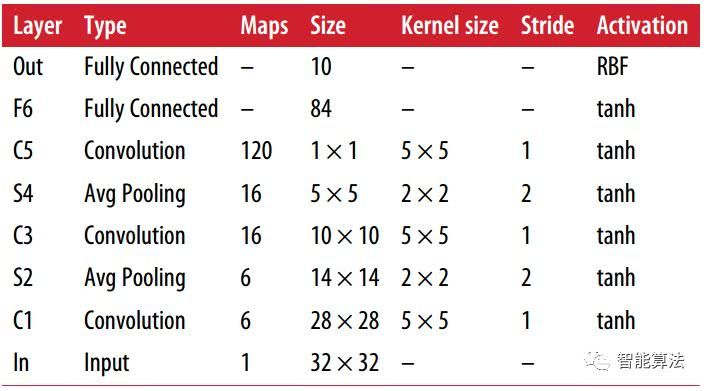
LeNET真的足够轻量，3层卷积，2个全连接层，2个平均池化层。而且它的输入Size只有32*32，参数量非常少。我甚至可以通过C++直接把它的前向传播过程写出来。非常方便FPGA HLS综合调试。
不过它也存在一些问题，比如:
1. 激活函数还是tanh，计算量太大了。我在后面将会改进为最近比较热门的Relu。
2. 平均池化最近几年用的比较少了，我将会改成最大池化。
3. 全连接层参数量太多了，是否能用卷积代替。

以上的这些问题，我将在第五章中，通过tensorflow搭建模型的方式，逐一解决。

## 4.用C++仿真神经网络
本周也完成了一个非常辉煌的工作，用6个for循环嵌套和一条语句，完成了神经网络卷积层设计。也算是为手写卷积神经网络提供了一个比较好的开始。下面是本次的代码:
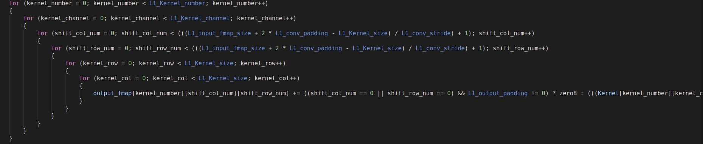
C++仿真LeNET神经网络已于20/10/2021完成。

## 5.优化创造新一代LeNET网络
为了避免之前网络选择错误，在本次设计的时候。我们将LeNET放入了Vivado HLS中进行评估，得到了如下的评估结果:
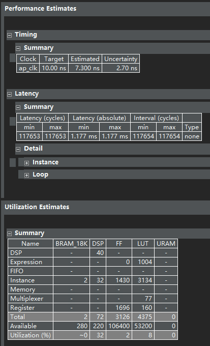

由于LeNET非常轻量，一层卷积花费了2ms的时间，以此可以预估，最后网络的速度能够达到15ms处理一帧数据。也就是每秒可以处理60张图片。如果在FPGA资源充足的情况下，多个PE核并行处理，能够达到非常不错的效果。

下周的工作目标顺序将为:
1. 用tensorflow实现改进后的LeNET网络，并在车牌识别数据集（http://www.ee.surrey.ac.uk/CVSSP/demos/chars74k/#download） 上训练，得到一个不错的识别准确率。
2. 用c++实现LeNET网络，并与Tensorflow计算结果比较
3. 将C++实现的LeNET网络 通过Vivado HLS进行加速，生成IP核。

本周使用TensorFlow搭建了改进版的LeNET模型，模型相关参数如下:
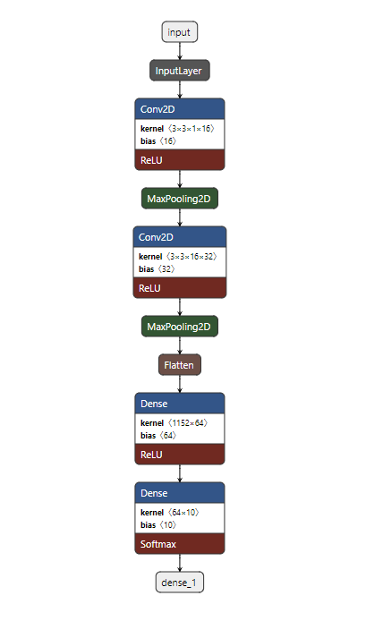
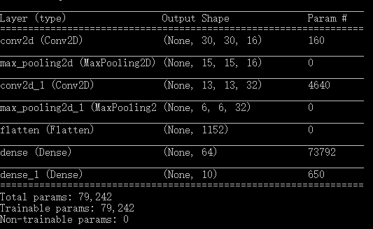

由于要将模型部署在FPGA上，并且由于要尽可能节省FPGA内部资源。所以我们采用Fixed Point 16bit(8bit interge)。在此情况下，为了防止整数部分overflow，造成计算结果错误，我们需要在训练的时候对数据集进行归一化处理（归一化至[0,1]区间）。
在SGD下，学习率为1xe-4,训练500个Epoch后得出如下正确率和损失：


最后，将模型使用C++手写实现，并放入Vivado HLS中进行加速。最后Process Element资源消耗如下:
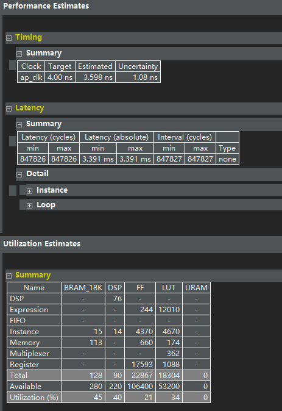
通过Vivado Block Design将PS与位于PL端的Process Element连接如下图:
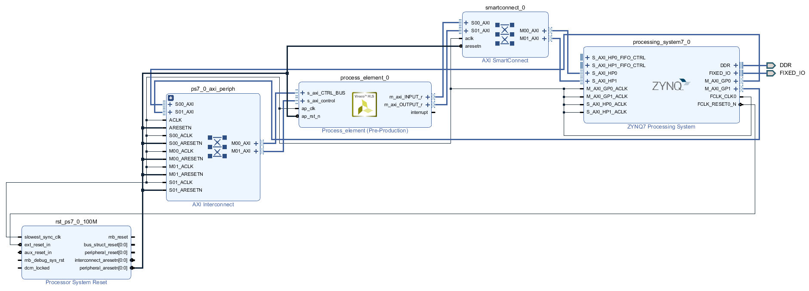
通过ZYNQ PS-PL之间强大的AXI总线进行图像矩阵的输入与结果矩阵的输出，并通过TCP协议，实现任意电脑对数据包的上传和对结果的获取。最终，经过对1万张图片(每类1000张)的测试，FPGA内部模型运行速度为845FPS。正确率为94.98%:
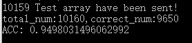

!!! 
在PS通过AXI BUS访问PL端Process Element的过程中，其实是对DDR内存地址的映射访问。数据从PL流入DDR地址中，DDR中的数据从DDR流入Data Cache中，最后流入Cortex A9中进行处理。在此过程中需要注意对Data Cache的对齐访问(A9 Cache Line 为32 Bytes)，否则会出现读出数据前段或后段不正确的情况。当然，如果不想对齐访问，还可以禁用Data Cache。将DDR中的数据直接送CPU。但这样会导致性能降低，因为CPU频率是高于读写DDR频率的，CPU将会等DDR读写。

## 6.使用C++手写实现通用卷积加速器，通用池化加速器，通用激活函数加速器，通用全连接加速器

由于之前针对于LeNET设计的比较宏观，细节掌控比较少。我们在了解了ZYNQ-7000系列所有型号FPGA硬件资源后，我们发现即便是ZYNQ-7100 PL端的Block RAM也无法放下MobileNET(虽然MobileNET已经算是非常轻量了)。
一种解决此问题比较好的方案是:将模型权重和偏置放在DDR中，由部署在PL端的Process Element去访问DDR实现对权重的加载。这个方案实现起来还有一个非常好的优势：因为权重都载入到DDR中，我们在设计HLS加速核时，是针对某一类计算层进行加速，而不是对整个网络进行加速。因此我们可以更好的把控每一层的加速细节。比如，对于卷积层的加速来说，我们进行的操作顺序为:
1. 从DDR中提取权重和输入矩阵到PL
2. 在PL根据计算结果
3. 将计算结果写回DDR

我们可以发现，步骤1和步骤3都需要进行数据读写。证明我们的加速器会花一定时间在数据数据传输上。那么如果能有一种方法，尽可能的缩短数据传输的时间，那么我们就可以尽可能的提高加速器的性能表现。
在此，我们发现了一种比较简单且有效的方式——使用缓冲机制。在最初，双缓冲被广泛的运用在图形显示上，避免了图形刷新带来的卡顿。我们认为:缓冲操作是否对一个系统有效的判断标准是【操作设备和被操作设备之间处理速度的差异】。例如，在图形显示中运行双缓冲机制，是因为显示器的刷新频率为30FPS(通常情况下)，而如果要在计算机上绘制一个图形，可能达不到这么快的速度。从而导致显示器从显存里面取数据显示时，计算机还没有在显存中绘制好完整的图像。

对于本加速器的情况来说，在一次加速过程中，读写DDR的消耗时间是大于计算的消耗时间的。也就是计算的频率大于读写DDR的频率。这样的话，每次计算完之后，就需要等DDR读写。消耗大量的时间。如果采用缓冲机制的话，在计算之前，已经准备好了N个缓冲区的数据等待计算。同时，在计算完成后，已经准备好了N个缓冲区的数据等待写入DDR。这样的话，可以实现在一个周期内，DDR读取，结果计算，DDR写入同时进行，提高了DDR读写频率，从而大大提高了加速器性能。
可以预见的是，在一定时钟频率下(比如250Mhz)，缓冲区的数量N存在最大值。因为更多的缓冲区会带来更多的硬件资源消耗。最佳的缓冲区数量N应该位于当DDR读写频率=计算频率处。

### 当Buffer=0时的卷积加速器性能

Vivado HLS综合结果:
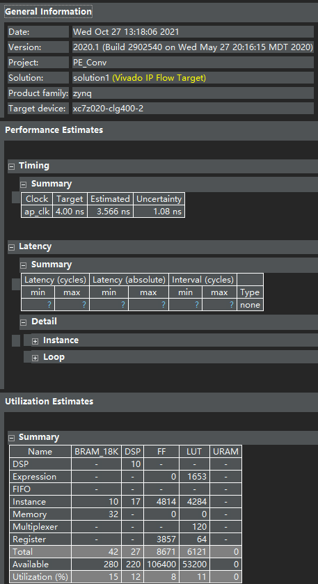
采用3 * 3 * 2 * 2kernel+7 * 7 * 2 fmap 测试成功：
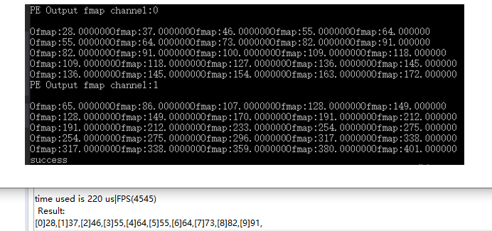